# Dashboard Global de Manufatura

## Descrição do Projeto

O **Dashboard Global de Manufatura** é uma plataforma corporativa de Business Intelligence (BI) de ponta a ponta desenvolvida para consolidar, padronizar e exibir indicadores críticos de desempenho operacional de múltiplas plantas industriais globalmente. 

A arquitetura do projeto foi desenhada para superar as limitações de sistemas legados descentralizados e prover visibilidade em tempo real para tomada de decisão executiva e operacional. O fluxo de dados é estruturado em três camadas principais:

```mermaid
flowchart LR
    subgraph Local ["Plantas Industriais Locais"]
        Baan["ERP Legacy<br>(BAAN V)"]
        DB[("Banco de Dados Local")]
        Baan --> DB
    end

    subgraph Cloud ["Ambiente Cloud de Dados"]
        Ingestion["Camada de Ingestão & CDC"]
        DWH[("Data Lakehouse / DWH")]
        Transform["Transformação & Master Data"]
        
        DB -->|Extração Incremental<br>via VPN Segura| Ingestion
        Ingestion --> DWH
        DWH --> Transform
    end

    subgraph Visualization ["Camada de Apresentação"]
        Tableau["Tableau Server / Cloud<br>(Dashboards Globais)"]
        Transform -->|Consumo via<br>Queries Otimizadas| Tableau
    end

    classDef local fill:#ffebee,stroke:#c62828,stroke-width:2px,color:#000000;
    classDef cloud fill:#e3f2fd,stroke:#1565c0,stroke-width:2px,color:#000000;
    classDef vis fill:#e8f5e9,stroke:#2e7d32,stroke-width:2px,color:#000000;
    class Baan,DB local;
    class Ingestion,DWH,Transform cloud;
    class Tableau vis;
```

1. **Camada de Origem (Legacy ERP BAAN V)**:
   * Extração de dados transacionais diretamente dos bancos de dados das plantas locais (que operam sob o ERP legado BAAN V).
   * Desafio técnico de lidar com conexões ODBC/JDBC legadas, tabelas não indexadas e alta concorrência em sistemas transacionais ativos.
2. **Ambiente Cloud de Dados**:
   * **Ingestão**: Transferência segura de dados via canais criptografados para a nuvem através de rotinas incrementais ou soluções baseadas em CDC (Change Data Capture) para minimizar o impacto nos servidores locais.
   * **Processamento e Transformação**: Modelagem de dados focada em unificação de esquemas, limpeza, deduplicação e consolidação de Master Data estruturado em esquemas estrela (Star Schema) ou Snowflake.
3. **Camada de Apresentação (Tableau)**:
   * Desenvolvimento de painéis interativos focados em três grandes pilares de indicadores de manufatura:
     * **Produção**: OEE (Overall Equipment Effectiveness), volumes produzidos e eficiência operacional.
     * **Qualidade**: Taxa de rejeição (scrap rate), conformidade de lotes e retrabalho.
     * **Estoque**: Giro de estoque, dias de suprimento (DOH) e acuracidade de inventário.

---

## Objetivo do Exercício

Esta entrega específica foca no **exercício prático de gestão avançada de riscos arquiteturais** associados à implementação da plataforma. A transição de dados de sistemas industriais legados e distribuídos geograficamente para um ecossistema analítico em nuvem apresenta riscos críticos à operação contínua das fábricas. 

O foco é identificar gargalos arquiteturais que possam impactar o ambiente produtivo da fábrica e propor estratégias de mitigação e contorno, garantindo uma comunicação clara com a diretoria.

---

## Organização do Repositório

A estrutura deste repositório foi projetada seguindo as melhores práticas de documentação técnica corporativa, separando de forma clara as fases do ciclo de gestão de riscos e a comunicação executiva associada.

A distribuição de pastas e arquivos está configurada da seguinte forma:

* [README.md]: Guia inicial do repositório, contendo a descrição geral do projeto, contextualização dos objetivos do exercício e uma breve descrição da organização do repositório.
* `riscos/`
  * [identificacao.md]: Registro inicial de riscos, descrevendo as ameaças arquiteturais mapeadas.
  * [analise.md]: Avaliação quantitativa e qualitativa dos riscos, classificando-os por probabilidade e impacto através de uma Matriz de Riscos, e identificando fatores condicionantes.
  * [respostas.md]: Detalhamento do plano de contingência e estratégias de resposta (evitar, mitigar, transferir, aceitar), especificando ações técnicas imediatas e responsáveis.
* `comunicacao/`
  * [status-stakeholders.md]: Relatório de status gerencial formatado para stakeholders executivos (C-Level), traduzindo termos puramente técnicos em impactos de negócio e ações propostas para suporte à tomada de decisão.
